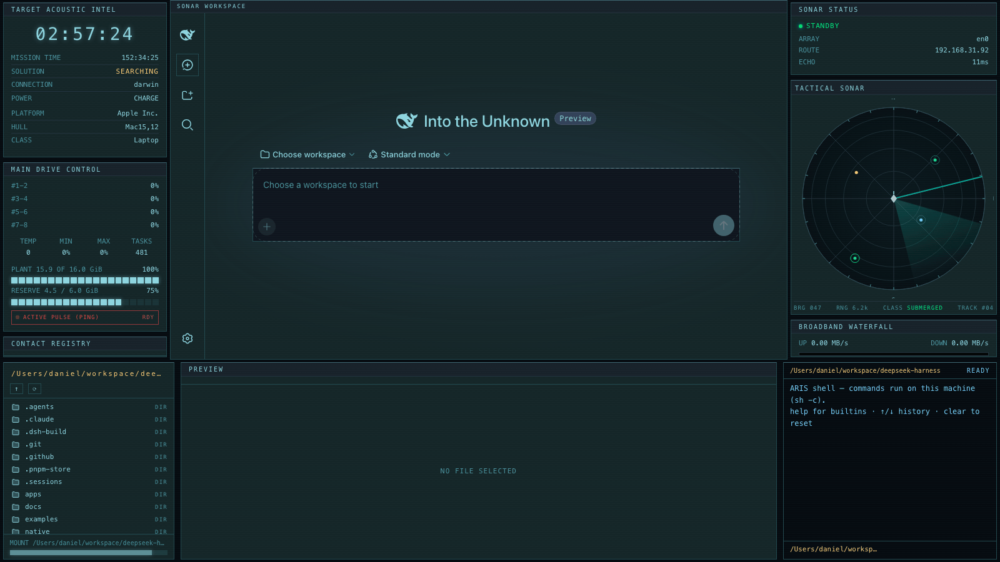
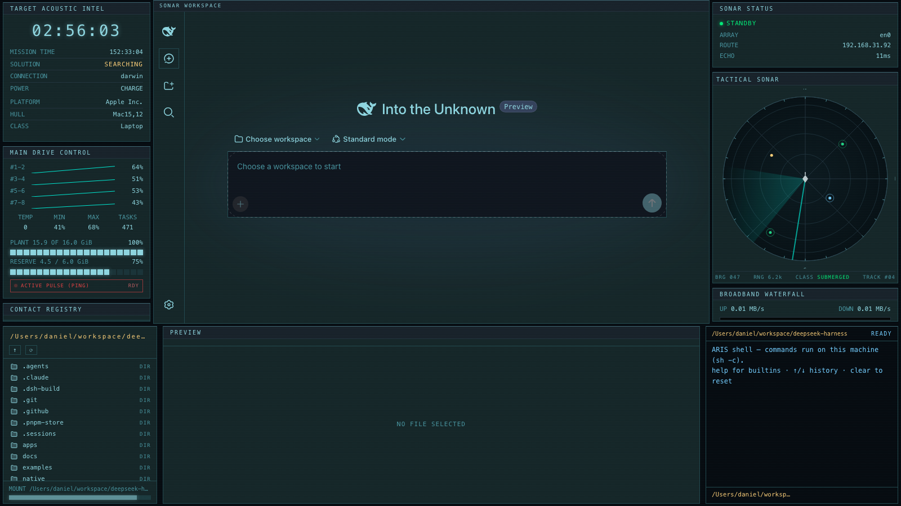

# SONAR STATION — dsh-edex-sonar-ui

**DeepSeek Harness eDEX-UI shell plugin** themed as a **submarine sonar station** —
driven by [The Silent Abyss](https://idgmatrix.github.io/silent-abyss/) tactical
sonar dashboard. A near-black blue-teal sonar console wraps the original DSH web
GUI: pale-cyan phosphor panels, 1px blue-gray instrument rules, a **TACTICAL
SONAR** scope with a rotating bearing sweep, a contact registry, and a broadband
waterfall — all around the fully working DSH workspace.





## Theme

- **Canvas** — near-black blue-teal `#060B10` with a fine scanline texture;
  widget cards float on it in a slightly lighter `#152628` surface (the
  reference's inverse-contrast look: panels lighter than the sea around them)
- **Borders** — thin `1px #2C4853` blue-gray rules at **0px radius** around every
  widget card, with a brighter top-edge rule and a `#18222A` title band under a
  hairline separator; ~16px gaps between cards
- **Phosphor** — pale cyan `#8ED5DF` accents/labels, `#4E929B` dim captions,
  `#C9D6D8` pale-white readings on `#5C7684` muted text
- **Signal colors** — BTR green `#03E877`, DEMON amber `#FACD78`, ping red
  `#E54344`, waterfall blue `#74CEFF`, active turquoise `#00E6D0`
- **Center chrome** — a `SONAR WORKSPACE` title strip + 1px frame around the
  original UI, which keeps its own theme recolored to the same palette via
  alias-token overrides (workspace background = the card surface)

## Widgets (reference reconciliation)

| Reference panel | eDEX slot | Treatment |
|---|---|---|
| Tactical 3D sonar view | `globe` → **`sonar`** (featured) | Circular sonar scope: range rings, bearing spokes/ticks, N/E/S/W labels, rotating turquoise sweep, teal-green/cyan/amber contact markers, pale own-ship icon, contact readout |
| SONAR STATUS | `network-status` | Green `PASSIVE MODE` pip line + array/route/echo readouts |
| MAIN DRIVE CONTROL | `cpu` | Shaft-channel sparklines over live core telemetry, plant/reserve bars, red `ACTIVE PULSE (PING)` strip |
| TARGET ACOUSTIC INTELLIGENCE | `info` | Station clock (mission timer), `SEARCHING` solution state in amber, platform/hull/class lines |
| CONTACT REGISTRY | `processes` | Bordered contact rows with hairline dividers, green classifications, loadavg footer |
| BROADBAND WATERFALL | `traffic` | Blue-white `#74CEFF` trace + BTR-green up trace on the near-black plot field |

Bottom widgets (filesystem browser, preview, terminal) keep their original
behavior, recolored by the theme; unmatched reference panels (LOFAR, DEMON,
water column, BTR, campaign, manual solution) are left as-is per the
reconciliation rules.

## Installation

The plugin is published to npm as `@danielng23/dsh-edex-sonar-ui`. From the
harness checkout:

```sh
pnpm dsh plugin --profile web add @danielng23/dsh-edex-sonar-ui
pnpm dsh web   # serves the sonar station over the default GUI
```

To run the local checkout instead of the npm release (for development), add
the bundle with a `file:` path and run `pnpm install` in the profile:

```sh
pnpm dsh plugin --profile web add file:/path/to/dsh-edex-sonar-ui/packages/bundle
```

## Development

See [LOCAL_DEVELOPMENT.md](LOCAL_DEVELOPMENT.md) for the build, install, and
iteration workflow. The widget architecture for the shell bars is documented in
[WIDGETS.md](WIDGETS.md); the reference analysis (palette, border language,
widget inventory) lives in [analysis.md](analysis.md) / [analysis.json](analysis.json).

## Packages

| Package | Host/Client | Description |
|---|---|---|
| `packages/bundle` | — | Installable bundle (`@danielng23/dsh-edex-sonar-ui`) |
| `packages/ui-edex` | client | The sonar-station shell frame and all widgets (`@danielng23/dsh-sonar-client-ui-edex`) |
| `packages/ui-theme-terminal` | client | Appearance → SONAR STATION theme row (`@danielng23/dsh-sonar-client-ui-theme-terminal`) |
| `packages/host/system-metrics` | host | System telemetry RPC + file read/write + `runCommand` shell execution (`@danielng23/dsh-sonar-host-system-metrics`) |

## License

MIT
